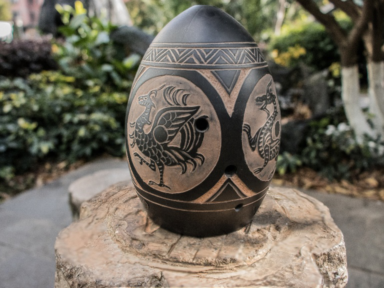
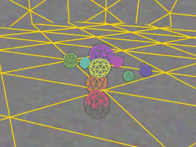
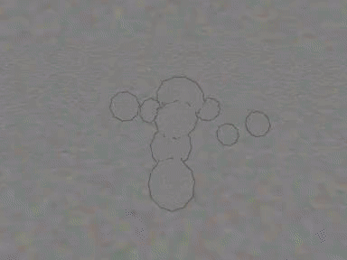
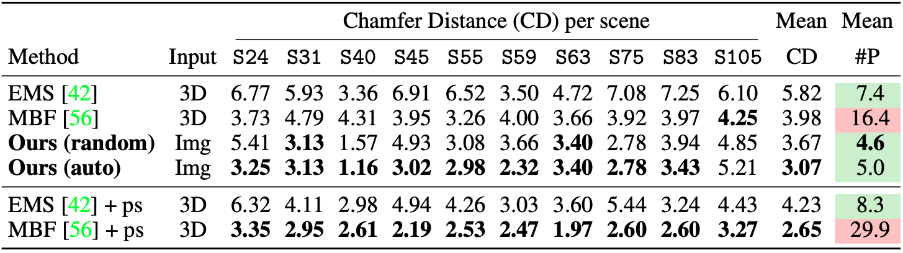

# Differentiable Blocks World 

<div align="center">
<h2>
Differentiable Blocks World:<br> Qualitative 3D Decomposition by Rendering Primitives
<p></p>

<a href="https://www.tmonnier.com">Tom Monnier</a>&ensp;
<a href="https://github.com/jake-austin">Jake Austin</a>&ensp;
<a href="https://people.eecs.berkeley.edu/~kanazawa/">Angjoo Kanazawa</a>&ensp;
<a href="https://people.eecs.berkeley.edu/~efros/">Alexei Efros</a>&ensp;
<a href="https://imagine.enpc.fr/~aubrym/">Mathieu Aubry</a>

<p></p>

<a href="https://www.tmonnier.com/DBW/"></a>
<a href="https://arxiv.org/abs/2307.05473"></a>
<a href="https://www.tmonnier.com/DBW/ref.bib"></a>
<p></p>

</h2>
</div>


https://github.com/roym899/differentiable-blocksworld/assets/9785832/addde5ea-cc8f-40aa-8960-b69fd36f860a


Modified PyTorch implementation of [**Differentiable Blocks World: Qualitative 3D Decomposition by Rendering Primitives**](https://arxiv.org/abs/2307.05473).

This fork has been modified to use [Rerun](https://github.com/rerun-io/rerun) for visualization.

Check out this [**webpage**](https://www.tmonnier.com/DBW/) for more video results!

This repository contains:

- scripts to download and load datasets
- configs to optimize the models from scratch
- evaluation pipelines to reproduce quantitative results
- guidelines to run the model on a new scene

<details>
<summary>If you find this code useful, don't forget to <b>star the repo :star:</b> and <b>cite the paper :point_down:</b></summary>

```
@article{monnier2023dbw,
  title={{Differentiable Blocks World: Qualitative 3D Decomposition by Rendering Primitives}},
  author={Monnier, Tom and Austin, Jake and Kanazawa, Angjoo and Efros, Alexei A. and Aubry, Mathieu},
  journal={{arXiv:2307.05473 [cs.CV]}},
  year={2023},
}
```

</details>

## Installation :construction_worker:

### 1. Setup environment :wrench:

#### Custom environment (venv / pyenv / direnv / etc.)

Starting from an empty Python environment (e.g., `python3 -m venv dbw`) with CUDA 11.7 or 11.8 available (check that `nvcc --version` is working), install torch for your CUDA version (see [PyTorch website](https://pytorch.org/get-started/locally/) for more details). 

Subsequently install all other requirements using 
```
pip install -r requirements.txt
```
Note that this will install pytorch3d from source, which requires torch to be installed first, hence the torch installation step above.

TODO make sure this works as expected

#### Conda

```
conda env create -f environment.yml
conda activate dbw
```

<details>
<summary><b>Optional live monitoring :chart_with_downwards_trend:</b></summary>
Some monitoring routines are implemented, you can use them by specifying your
visdom port in the config file. You will need to install visdom from source beforehand:

```
git clone https://github.com/facebookresearch/visdom
cd visdom && pip install -e .
```
</details>

<details>
<summary><b>Optional Nerfstudio dataloading :tractor:</b></summary>
If you want to load data processed by Nerfstudio (e.g., for a custom scene),
you will need to install nerfstudio as described 
<a href=https://github.com/nerfstudio-project/nerfstudio/blob/main/docs/quickstart/installation.md>here</a>.
In general, executing the following lines should do the job:

```
pip install ninja==1.10.2.3 git+https://github.com/NVlabs/tiny-cuda-nn/#subdirectory=bindings/torch
pip install nerfstudio==0.1.15
```

</details>

### 2. Download datasets :arrow_down:

```
bash scripts/download_data.sh
```

This command will download one of the following sets of scenes presented in the paper:

- `DTU`: [paper](https://roboimagedata2.compute.dtu.dk/data/text/multiViewCVPR2014.pdf) /
  [dataset](https://www.dropbox.com/s/bl5j5pfczf90lmr/DTU.zip)
  (1.86GB, pre-processing conventions come from
  [IDR](https://github.com/lioryariv/idr/blob/main/DATA_CONVENTION.md), big thanks to the team!)
- `BlendedMVS`: [paper](https://arxiv.org/abs/1911.10127) / 
  [dataset](https://www.dropbox.com/s/c88216wzn9t6pj8/BlendedMVS.zip) 
  (115MB, thanks to the [VolSDF](https://github.com/lioryariv/volsdf) team for hosting the dataset)
- `Nerfstudio`: [paper](https://arxiv.org/abs/2302.04264) / 
  [repo](https://github.com/nerfstudio-project/nerfstudio) /
  [dataset](https://drive.google.com/file/d/1wsUVqJlsZY-dp9dSemghGe0ijOo9AOM5/view?usp=sharing) 
  (2.67GB, images and Nerfacto models for the 2 scenes in the paper)

It may happen that `gdown` hangs, if so download the file manually and move it to the `datasets` folder.

## How to use :rocket:

### 1. Run models from scratch :runner:

   

To launch a training from scratch, run:

```
cuda=gpu_id config=filename.yml tag=run_tag ./scripts/pipeline.sh
```

where `gpu_id` is a device id, `filename.yml` is a config in `configs` folder, `run_tag` is a tag for the experiment.

Results are saved at `runs/${DATASET}/${DATE}_${run_tag}` where `DATASET` is the dataset name 
specified in `filename.yml` and `DATE` is the current date in `mmdd` format.

<details>
<summary><b>Available configs :high_brightness:</b></summary>

- `dtu/*.yml` for each DTU scene
- `bmvs/*.yml` for each BlendedMVS scene
- `nerfstudio/*.yml` for each Nerfstudio scene

*NB:* for running on Nerfstudio scenes, you need to install [nerfstudio](https://github.com/nerfstudio-project)
library (see installation section)

</details>

<details>
<summary><b>Computational cost :moneybag:</b></summary>

The approximate optimization time is roughly 4 hours on a single GPU.

</details>

### 2. Reproduce quantitative results on DTU :bar_chart:



Our model is evaluated at the end of each run and scores are written in `dtu_scores.tsv`
for the official Chamfer evaluation and `final_scores.tsv` for training losses, transparencies and
image rendering metrics.
To reproduce our results on a single DTU scene, run the 
following command which will launch 5 sequential runs with different seeds
(the `auto` score is the one with minimal training loss):

```
cuda=gpu_id config=dtu/scanXX.yml tag=default_scanXX ./scripts/multi_pipeline.sh
```

<details>
<summary><b>Get numbers for EMS and MBF baselines :clipboard:</b></summary>

For completeness, we provide scripts for processing data and evaluating the following baselines:

- [EMS](https://github.com/bmlklwx/EMS-superquadric_fitting): run `scripts/ems_pproc.sh`, then apply
  EMS using the official repo, then run `scripts/ems_eval.sh` to evaluate the 3D decomposition
- [MBF](https://github.com/MichaelRamamonjisoa/MonteBoxFinder): run `scripts/mbf_pproc.sh`, then apply
  MBF using the official repo, then run `scripts/mbf_eval.sh` to evaluate the 3D decomposition

Do not forget to update the path of the baseline repos in `src/utils/path.py`. 
Results will also be computed using the preprocessing step removing the ground from the 3D input.

</details>

### 3. Train on a custom scene :crystal_ball:

If you want to run our model on a custom scene, we recommend using 
[Nerfstudio](https://github.com/nerfstudio-project/nerfstudio/) framework and guidelines
to process your multi-views, obtain the cameras and check their quality by optimizing their default 3D model.
The resulting data and output model should be moved to `datasets/nerfstudio` folder in the same format as
the other Nerfstudio scenes (you can also use symlinks).

Then, you can add the model path in the custom Nerfstudio dataloader (`src/datasets/nerfstudio.py`), create a new 
config from one of our nerfstudio config and run the model. One thing that is specific to each scene is
the initialization of `R_world` and `T_world`, which can be roughly estimated by visual comparisons in
plotly or Blender using the pseudo ground-truth point cloud.

## Further information :books:

If you like this project, check out related works from our group:

- [Loiseau et al. - Learnable Earth Parser: Discovering 3D Prototypes in Aerial Scans (arXiv
  2023)](https://romainloiseau.fr/learnable-earth-parser/)
- [Monnier et al. - Share With Thy Neighbors: Single-View Reconstruction by Cross-Instance Consistency (ECCV
  2022)](https://www.tmonnier.com/UNICORN/)
- [Darmon et al. - Improving neural implicit surfaces geometry with patch warping (CVPR
  2022)](https://imagine.enpc.fr/~darmonf/NeuralWarp/)
